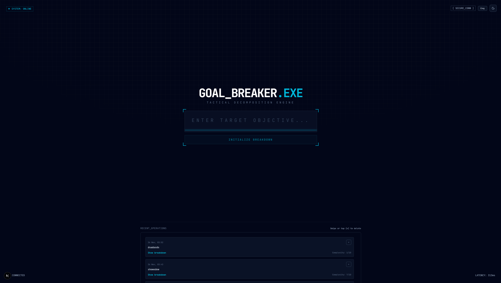
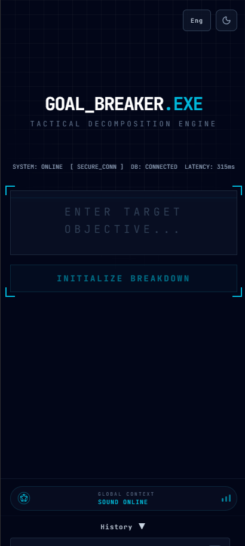

# GOAL_BREAKER.EXE 🚀
> **Tactical Objective Decomposition System**


**Stop dreaming. Start executing.**

GOAL_BREAKER.EXE is a mission-control interface that strips away the fluff from your vague ideas and converts them into a precise, 5-step tactical execution plan. Powered by Google's Gemini AI, wrapped in a "Dark Technical" aesthetic, and engineered for operators who demand clarity.

---

## 📡 The Mission
You have a goal. It's vague. "Launch a startup." "Get fit." "Learn Amharic."
GOAL_BREAKER.EXE takes that signal, filters out the noise, and returns a **Tactical Breakdown**: five chronological, high-impact steps with a complexity score. It doesn't stop there—drill down into any step to generate specific subroutines.

## 📸 Visual Reconnaissance

| **Desktop Command Center** | **Mobile Field Unit** |
|:---:|:---:|
|  |  |
| *Full telemetry, history grid, and inline expansion.* | *Compact typography, slide-up drawers, and thumb-friendly controls.* |

---

## ⚡ Operational Capabilities

### 🎯 Precision Breakdown
Input any objective. The system analyzes it and returns exactly **5 actionable steps**. No fluff. No "believe in yourself." Just execution.
- **Complexity Score**: Auto-calculated difficulty rating (1-10).
- **Tone**: "Dark Technical" (concise, professional, military-grade).

### 🔍 Deep Dive Subroutines
Click any step to activate the **Subroutine Drawer**. The system recursively breaks that single step into 3 specific tactical sub-actions.
- *Example*: Step: "Audit Market" -> Subroutines: "Analyze competitors," "Survey 100 users," "Map pricing models."

### 🛡️ Active Guardrails
We don't let garbage in. The `guardrails.py` module uses a dedicated Gemini Flash-Lite model to classify every input:
- **OK**: Proceeds to breakdown.
- **GIBBERISH**: Returns a "Signal Noise" protocol (e.g., "Clarify objective").
- **ABUSE**: Returns a "Hostile Input" protocol (e.g., "Terminate session").
*Zero blank screens. Even errors are handled in-character.*

### 🔊 Haptic Audio Layer
The interface feels alive.
- **Typing**: Mechanical key clicks.
- **Processing**: Low-frequency hum during AI generation.
- **Success**: Satisfying chime on completion.
- **Subroutine**: Distinct ping when drilling down.
*(Toggleable via the Global Context pill on Desktop or Footer on Mobile).*

### 🌍 Bilingual Ops
Native support for **English** and **Amharic**.
- Switch languages instantly.
- The AI adapts the "Dark Technical" tone to Amharic (e.g., "የታክቲክ እቅድ" instead of just "Plan").

---

## 🧠 The Logic
How it works under the hood:

1.  **Ingestion**: User input hits the Next.js frontend and is relayed to the FastAPI backend.
2.  **Sanitization**: `guardrails.py` intercepts the payload.
3.  **Classification**: Gemini 2.0 Flash-Lite categorizes the intent.
4.  **Synthesis**:
    *   If `OK`: `services.py` prompts Gemini 2.5 Flash for a structured JSON response.
    *   If `Offline`: Deterministic fallback plans engage so the UI never breaks.
5.  **Rendering**: The frontend parses the JSON, animating the results into the dot-grid cockpit.

---

## 🛠️ Deployment Protocols

### Prerequisites
- Node.js 20+ & pnpm
- Python 3.10+
- Google Gemini API Key
- PostgreSQL Database (Neon/Local)

### 1. Clone & Initialize
```bash
git clone https://github.com/LeulTew/Ignition.git
cd Ignition
pnpm install  # Installs root and frontend dependencies
```

### 2. Backend Setup (FastAPI)
```bash
cd backend
python -m venv venv
source venv/bin/activate
pip install -r requirements.txt

# Start the frequency
uvicorn app.main:app --reload --port 8000
```

### 3. Frontend Setup (Next.js)
```bash
cd frontend
# (Dependencies already installed via root pnpm install)

# Ignite the cockpit
pnpm dev
```

### 4. Environment Variables
Create `.env` files in `backend/` and `frontend/`.

**Backend (`backend/.env`)**
| Variable | Description |
| :--- | :--- |
| `GEMINI_API_KEY` | **Required**. Your Google GenAI key. |
| `DATABASE_URL` | **Required**. Postgres connection string. |
| `GEMINI_MODEL_CHAIN` | *Optional*. Comma-separated models (default: `gemini-2.5-flash`). |

**Frontend (`frontend/.env.local`)**
| Variable | Description |
| :--- | :--- |
| `NEXT_PUBLIC_API_URL` | URL of your backend (e.g., `http://localhost:8000`). |
| `DATABASE_URL` | Same as backend (for Server Actions). |

---

## 🧪 Testing & QA

Ensure system integrity before deployment.

**Backend Verification**
```bash
cd backend
./venv/bin/python -m pytest
```

**Frontend Integrity**
```bash
cd frontend
pnpm lint
```

**Manual QA Matrix**
Consult [`docs/QA_CHECKLIST.md`](./docs/QA_CHECKLIST.md) for the full black-box testing procedure covering desktop, mobile, and edge cases.

---

## 🏗️ Tech Stack

| Layer | Technology |
| :--- | :--- |
| **Frontend** | Next.js 16 (App Router), React 19, Tailwind CSS 4 |
| **UI Library** | shadcn/ui, Radix Primitives, Lucide Icons |
| **Backend** | FastAPI, Uvicorn, Pydantic |
| **AI Core** | Google Gemini 2.5 Flash (Logic), Gemini 2.0 Flash-Lite (Guardrails) |
| **Database** | PostgreSQL, Prisma ORM |
| **Audio** | Web Audio API (Custom Synth) |

---

## 📄 License
MIT License. Built for the builders.

[**View Release Plan**](./RELEASE_PLAN.md) | [**Report Bug**](https://github.com/LeulTew/Ignition/issues)
